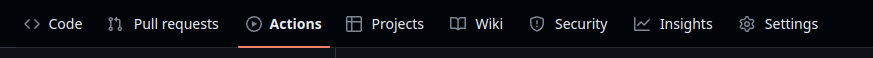
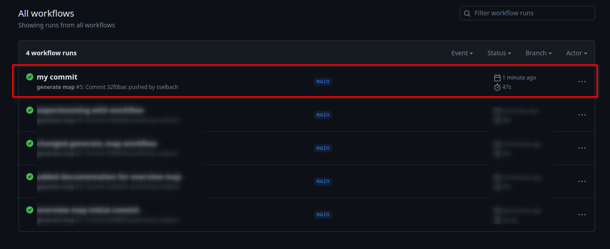
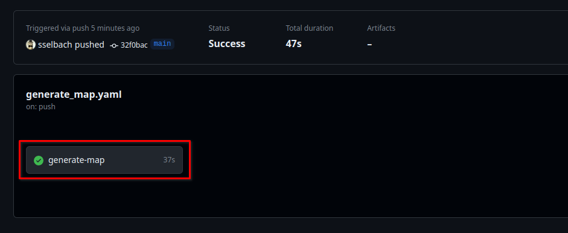
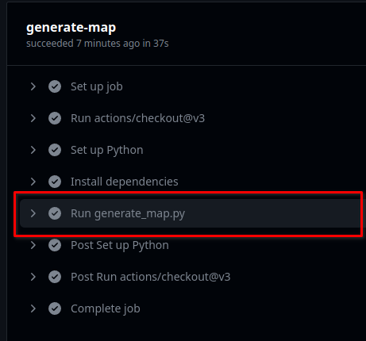

# Crypto Regulations Overview Map

This GitHub Repository automatically generates an overview world map of the crypto import/export regulations that are found in the `data/countries` directory. It does so via a Python script that is invoked by a GitHub action whenever a commit is pushed.

The map is an interactive leaflet.js map and can be found in `map/export`. The most recent maps are named `import.html` and `export.html` respectively, older maps are archived as `import_statusuntil_YYYYMMDD.html` and `export_statusuntil_YYYYMMDD.html`.

The geographical dataset is taken from the Natural Earth project: https://www.naturalearthdata.com/downloads/110m-cultural-vectors/

## Tagging

Country data is stored in markdown files in `data/countries`. For the script to recognize country data, the markdown files should have a summary in the format demonstrated by example below:

```
### Summary
Alpha2: ca

Export: medium

Import: relaxed
```

 - `Alpha2` is the [ISO Alpha2 country code](https://en.wikipedia.org/wiki/ISO_3166-1_alpha-2) of the country you are referencing. You can find a list of all codes that are available on the map in the file `map/export/crypto_data.csv`

  - `Export` and `Import` are the tags for the respective regulations. You can choose from the following values:
    - `unknown`
    - `relaxed`
    - `medium`
    - `strict`

The location of the summary section within the document is not important.

## Logs

The script produces debugging output that can be found as part of the standout output of the GitHub action that invokes it. Usually it takes a minute or so for the output to be available.

To find it starting from the repository root, navigate to 'Actions':



Select the workflow run from your commit (likely the most recent one at the top):



Select the 'generate-map' job:



Finally, open the 'Run generate_map.py' tab to see the output of the script:

